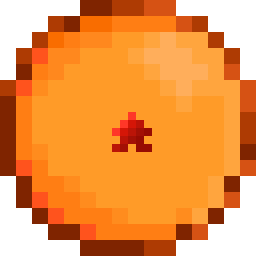

# DragonMineZ

  

  <strong>Mod de Minecraft inspirado en Dragon Ball Z</strong>

  🌎 English | 🇪🇸 Español | 🇧🇷 Português

---

## ¿Qué es DragonMineZ?

DragonMineZ es un mod de Minecraft creado por fans para fans, que brings the exciting world of Dragon Ball Z to your Minecraft experience. Embark on an adventure alongside Goku and experience the story like never before.

### Características Principales

- **Sistema de Transformaciones** — Desbloquea y activa diversas transformaciones icónicas de Dragon Ball Z
- **Combat Mechanics** — Sistema de combate mejorado con técnicas especiales y efectos visuales únicos
- **HairSalon** — Crea, comparte y descubre diseños de cabello únicos en nuestra comunidad
- **Visor 3D** — Previsualiza los diseños de cabello en tiempo real antes de aplicarlos
- **Multilingual** — Soporte completo para español, inglés y portugués
- **Actualizaciones Constantes** — Nuevas características y mejoras publicadas regularmente

---

## Descargar

Obtén DragonMineZ en tus plataformas favoritas:

---

## Comunidad

### Únete a la Patrulla del Tiempo

Conéctate con miles de jugadores, encuentra grupos para incursiones y mantente al día con las últimas novedades.

### Síguenos

---

## HairSalon

El HairSalon es el corazón creativo de DragonMineZ. Explora miles de diseños creados por la comunidad, sube los tuyos propios y marca tus favoritos.

### ¿Cómo funciona?

1. Explora diseños populares o busca algo específico
2. Crea tu propia cuenta para publicar creaciones
3. Usa el visor 3D para previsualizar antes de aplicar
4. Copia el código y úsalo en el juego

---

## Legal

**DragonMineZ es un proyecto de fans y no está afiliado con Bandai Namco, Toei Animation o cualquiera de sus empresas asociadas.**

Dragon Ball Z™ y todos los personajes relacionados son marcas registradas de Shueisha, Toei Animation y empresas asociadas. Este proyecto cumple con las políticas de fair use y fue creado con el propósito de entretenimiento y admiración por la comunidad.

Para más detalles sobre la política de contenido, consulta nuestra documentación.

---

  Hecho con 💪 por fans, para fans

