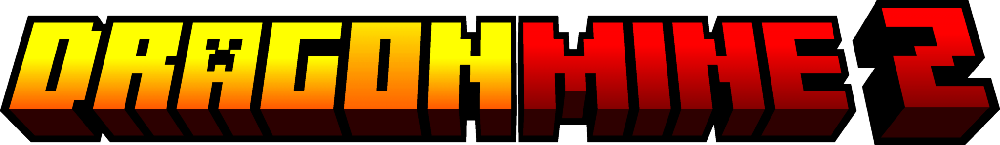

  

## About

DragonMineZ Web is the official web platform for [DragonMineZ](https://github.com/DragonMineZ/dragonminez), a Minecraft mod inspired by Dragon Ball Z. This website allows you to explore, create and share hair designs for your character.

  
  

## Tech Stack

  
  
  
  
  
  
  
  

## Features

- **HairSalon** — Explore thousands of hair designs created by the community
- **3D Viewer** — Preview any hair design in real-time with multiple angles
- **Hair Editor** — Create and edit hairs in the browser with a live 3D preview, fully compatible with the in-game editor codes (`DMZ1:` / `DMZF1:`)
- **Design Creator** — Publish your own hair designs to the community
- **Blog** — News, guides and updates with categories and subcategories, written by users holding the DMZ Author Discord role
- **Moderation** — DMZ Authors and Moderators can remove HairSalon designs; Moderators can remove blog posts
- **Favorites** — Save your favorite designs for quick access
- **Multi-language** — Interface available in Spanish, English and Portuguese

## Configuration

### Environment variables

| Variable | Required | Description |
| --- | --- | --- |
| `DATABASE_URL` | ✅ | PostgreSQL connection string |
| `PUBLIC_CLERK_PUBLISHABLE_KEY` / `CLERK_SECRET_KEY` | ✅ | Clerk authentication (Discord social connection) |
| `CLERK_WEBHOOK_SIGNING_SECRET` | ✅ | Clerk → DB user sync webhook |
| `DISCORD_GUILD_ID` | Optional | DMZ server ID — ships as an in-code default, override only if it changes |
| `DISCORD_AUTHOR_ROLE_ID` | Optional | Author role ID — ships as an in-code default |
| `DISCORD_MODERATOR_ROLE_ID` | Optional | Moderator role ID — ships as an in-code default |
| `DISCORD_BOT_TOKEN` | Optional | Bot token (bot must be in the guild). Preferred role-lookup method; without it the user's Discord OAuth token is used, which **requires the `guilds.members.read` scope on Clerk's Discord connection** |

After changing the Prisma schema run `bunx prisma migrate deploy` against your database (the blog tables ship in `prisma/migrations/20260609000000_add_blog`). Seed blog/hair categories with `bun prisma/seed.ts`.

### Landing page content

The home page intro videos and the GIF/info showcase sections are configured in
[`src/config/landing.ts`](src/config/landing.ts) — drop files into `public/videos/`
and `public/media/`, then list them there. Every text field accepts either a plain
string or `{ es, en, pt }` per-language values.

## Authors

### Developers

- [benja](https://github.com/bennndev) | *Programmer, Deploy & UX/UI Designer*.

### Contributors

- [facub8](https://github.com/facub8) | *3D Viewer implementation*.

## License

2025, DragonMineZ. This program is free software: you can redistribute it and/or modify it under the terms of the GNU General Public License as published by the Free Software Foundation, either version 3 of the License or (at your option) any later version.
[GNU General Public License v3.0](https://github.com/DragonMineZ/dragonminez-web/blob/main/LICENSE)
